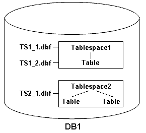

= Ejemplos de operaciones de backup, restauración y recuperación
:allow-uri-read: 
:icons: font
:imagesdir: ../media/

[role="lead"]
Puede encontrar información sobre algunos de los escenarios de backup, restauración y recuperación que puede usar para lograr sus objetivos de protección de datos.

En la siguiente ilustración se muestra el contenido del tablespace:

En la ilustración, Tabespace1 tiene una tabla y dos archivos de base de datos asociados. Tabespace2 tiene dos tablas y un archivo de base de datos asociado.

En las siguientes tablas se describen algunos escenarios de backup, restauración y recuperación completos y parciales:

== Ejemplos de operaciones de backup, restauración y recuperación completas

[cols="1a,1a,1a"]
|===
| Backup completo | Restaurar | Recuperación 

 a| 
SnapManager realiza un backup del todo en la base de datos DB1, incluidos los archivos de datos, los registros de archivo y los ficheros de control.
 a| 
La restauración completa con archivos de control SnapManager restaura todos los archivos de datos, espacios de tablas y archivos de control en el backup.
 a| 
Puede especificar una de las opciones siguientes:

* SCN: Introduzca un SCN, como 384641.
* Fecha/hora: Introduzca una fecha y hora de la copia de seguridad, como 2005-11-25:19:06:22.
* La última transacción realizada a la base de datos.

 a| 
Restauración completa sin archivos de control SnapManager restaura todos los espacios de tablas y archivos de datos, sin los archivos de control.

 a| 
Cuando se restauran los archivos de datos o los espacios de tablas con archivos de control, se especifica una de las siguientes opciones:

* Espacios de tabla
* Archivos de datos

 a| 
SnapManager recupera los datos a la última transacción realizada a la base de datos.

 a| 
Restaure los ficheros de datos o los espacios de tablas sin los ficheros de control.SnapManager restaura uno de los siguientes elementos:

* Espacios de tabla
* Archivos de datos

 a| 
Únicamente restaure los archivos de control

|===

== Ejemplos de operaciones de backup, restauración y recuperación parciales

[cols="1a,1a,1a"]
|===
| Copia de seguridad parcial | Restaurar | Recuperación 

 a| 
Es posible elegir una de las siguientes opciones:

* Espacios de tabla
+
Puede especificar Tablespaca1 y Tabespaca2 o sólo uno de ellos.

* Archivos de datos
+
Puede especificar los tres archivos de base de datos (TS1_1.dbf, TS1_2.dbf y TS2_1.dbf), dos archivos o un archivo.

Independientemente de la opción que seleccione, el backup incluirá todos los archivos de control. Los archivos de registro de archivos se incluyen en el backup parcial si el perfil no está habilitado para crear los backups de los registros de archivos por separado.
 a| 
La restauración completa de SnapManager restaura todos los archivos de datos, los espacios de tablas y los archivos de control especificados en el backup parcial.
 a| 
SnapManager recupera los datos a la última transacción realizada a la instancia de la base de datos.

 a| 
Restaure los archivos de datos o los espacios de tablas con los archivos de control SnapManager restaura uno de los siguientes elementos:

* Todos los archivos de datos especificados
* Todos los espacios de tablas especificados

 a| 
Restaure los archivos de datos o los espacios de tablas sin los archivos de control SnapManager restaura uno de los siguientes elementos:

* Espacios de tabla
+
Especifique cualquiera de los espacios de tablas. SnapManager restaura solo los espacios de tablas especificados. Si la copia de seguridad contiene tablespace1, SnapManager sólo restaura ese tablespace.

* Archivos de datos
+
Especifique cualquiera de los archivos de la base de datos. SnapManager solo restaura los archivos de datos especificados. Si la copia de seguridad contiene archivos de base de datos (TS1_1.dbf y TS1_2.dbf), SnapManager sólo restaura esos archivos.

 a| 
Únicamente restaure los archivos de control

|===