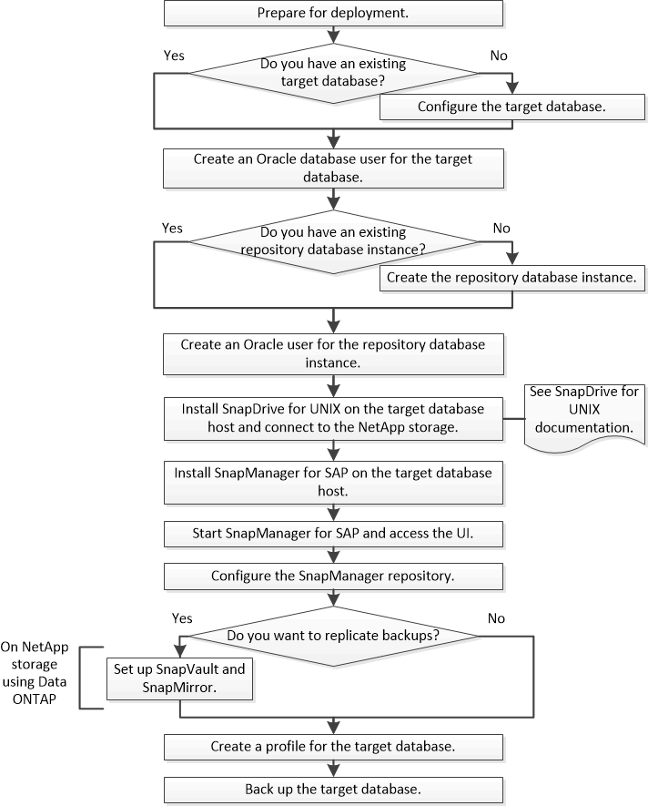

= Flujo de trabajo de implementación
:allow-uri-read: 
:icons: font
:imagesdir: ../media/

[role="lead"]
Antes de poder crear backups con SnapManager, primero debe instalar SnapDrive para UNIX y, a continuación, instalar SnapManager para SAP.

