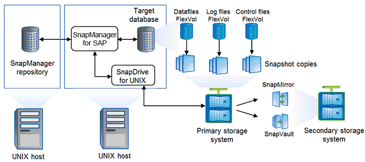

= Arquitectura SnapManager
:allow-uri-read: 
:icons: font
:imagesdir: ../media/

[role="lead"]
SnapManager para SAP incluye componentes que trabajan conjuntamente para proporcionar una solución completa y potente de backup, restauración, recuperación y clonación para bases de datos Oracle.

== SnapDrive para UNIX

SnapManager requiere que SnapDrive establezca la conexión con el sistema de almacenamiento. Debe instalar SnapDrive para UNIX en cada host de la base de datos de destino antes de instalar SnapManager.

== SnapManager para SAP

Debe instalar SnapManager para SAP en cada host de la base de datos de destino.

Puede usar la interfaz de línea de comandos (CLI) o la interfaz de usuario desde el host de base de datos donde se ha instalado SnapManager para SAP. También puede usar la interfaz de usuario de SnapManager de forma remota mediante un explorador web desde cualquier sistema que se ejecute en un sistema operativo compatible con SnapManager.

NOTE: La versión de JRE compatible es 1.8.

== Base de datos de destino

La base de datos de destino es una base de datos de Oracle que se desea gestionar mediante SnapManager para realizar operaciones de backup, restauración, recuperación y clonado.

La base de datos de destino puede ser independiente, Real Application Clusters (RAC) o residir en volúmenes de Oracle Automatic Storage Management (ASM). Para obtener detalles sobre las versiones, las configuraciones, los sistemas operativos y los protocolos de la base de datos de Oracle admitidos, consulte la herramienta de matriz de interoperabilidad de NetApp.

== Repositorio de SnapManager

El repositorio de SnapManager reside en una base de datos de Oracle y almacena metadatos sobre perfiles, backups, restauración, recuperación y clonado. Un único repositorio puede contener información sobre las operaciones realizadas en varios perfiles de base de datos.

El repositorio de SnapManager no puede residir en la base de datos de destino. La base de datos del repositorio de SnapManager y la base de datos de destino deben estar en línea antes de ejecutar operaciones de SnapManager.

== Sistema de almacenamiento primario

SnapManager realiza un backup de las bases de datos objetivo en el sistema de almacenamiento primario de NetApp.

== Sistema de almacenamiento secundario

Cuando se habilita la protección de datos en un perfil de base de datos, los backups creados en el sistema de almacenamiento principal por SnapManager se replican en un sistema de almacenamiento secundario de NetApp mediante las tecnologías SnapVault y SnapMirror.

*Información relacionada*

http://mysupport.netapp.com/matrix["Herramienta de matriz de interoperabilidad de NetApp"^]
