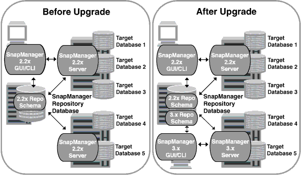

= Actualizar hosts de SnapManager mediante actualización gradual
:allow-uri-read: 
:icons: font
:imagesdir: ../media/

[role="lead"]
El enfoque de actualización gradual que permite actualizar los hosts de forma escalonada y host por host se admite desde SnapManager 3.1.

SnapManager 3.0 o versiones anteriores solo permitió actualizar todos los hosts al mismo tiempo. Esto provocó un tiempo de inactividad de todos los hosts SnapManager y las operaciones programadas durante la operación de actualización.

La actualización gradual ofrece las siguientes ventajas:

* Se ha mejorado el rendimiento de SnapManager porque solo se actualiza un host a la vez.
* Capacidad para probar las nuevas funciones en un host de servidor SnapManager antes de actualizar los otros hosts.

NOTE: Solo se puede realizar la actualización gradual mediante la interfaz de línea de comandos (CLI).

Después de completar correctamente la actualización, los hosts de SnapManager, los perfiles, las programaciones, las backups, Además, los clones asociados con los perfiles de las bases de datos de destino se migran de la base de datos del repositorio de la versión de SnapManager anterior a la base de datos del repositorio de la nueva versión. Los detalles sobre las operaciones realizadas mediante los perfiles, las programaciones, los backups y los clones que se crearon con la versión anterior de SnapManager ahora están disponibles en la base de datos del repositorio de la nueva versión. Puede iniciar la GUI utilizando los valores de configuración predeterminados del archivo user.config. No se consideran los valores configurados en el archivo user.config de la versión anterior de SnapManager.

El servidor SnapManager actualizado ahora puede comunicarse con la base de datos del repositorio actualizada. Los hosts que no se actualizaron pueden gestionar sus bases de datos de destino mediante el repositorio de la versión anterior de SnapManager y, por lo tanto, pueden utilizar las funciones disponibles en la versión anterior.

NOTE: Antes de realizar la actualización gradual, debe asegurarse de que todos los hosts de la base de datos del repositorio puedan resolverse. Para obtener información acerca de cómo resolver los hosts, consulte _Troubleshooting SnapManager for SAP_.
